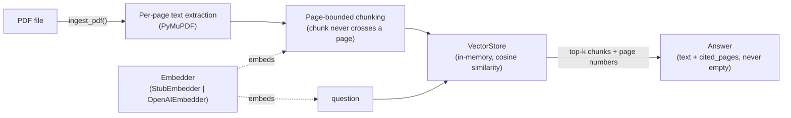

# Architecture — docubrain

## v0.1 (current)

## Design decisions

**Why page-bounded chunking, not sliding-window-across-pages?**
The whole product promise is "cited answers you can verify." A chunk that spans a page boundary makes the citation ambiguous — page 4? page 5? Both? Keeping chunks strictly inside one page means every citation is exact.

**Why a pluggable `Embedder` protocol instead of hardcoding OpenAI?**
Two reasons: (1) the demo and test suite need to run with zero API keys and zero network calls — that's a hard requirement, not a nice-to-have; (2) production users may want a different embedding backend without touching ingestion, storage, or the API layer.

**Why is `Answer` validated at the dataclass level (`__post_init__`), not just "by convention" in `qa.py`?**
Because "never return an uncited answer" is the core trust promise of the product. Putting the check in the data model itself means it holds even if a future code path (a new endpoint, a batch job, a different caller) forgets to check — the object literally cannot be constructed otherwise.

**Why in-memory vector search for v0.1 instead of Qdrant on day one?**
The `VectorStore` class is the only thing that would need to change to swap backends — everything above it (ingestion, chunking, `ask()`, the API layer) is backend-agnostic. Shipping the simplest correct version first, matching the pattern used across the other flagship repos (tracelens's Storage-Protocol split, instaml's pluggable online store).

## Planned v0.2 architecture (layout-aware, see ROADMAP.md)

The original product vision includes multi-modal indexing (text + layout + image regions) so a citation can highlight the *exact region* of a page, not just the page number. That requires a real layout model (Unstructured / Donut) and image-region storage, which is deliberately deferred — v0.1 proves the core "always-cited" product loop first with the simplest possible extraction layer.
